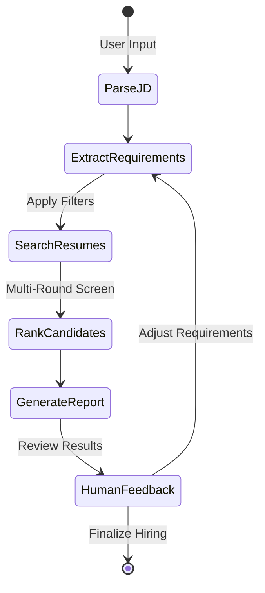

# Agentic Profile Matching

A LangGraph-based resume matching project that lets you describe a role in natural language, rank resumes from the local Chroma index, compare candidates, and refine the search mid-conversation.

## What this project does

- Parses a job description or a free-form request into structured requirements.
- Searches the resume index with semantic retrieval and scoring.
- Produces a ranked shortlist with reasoning, gaps, and screening questions.
- Supports follow-up queries like comparisons, explanations, and requirement changes.
- Preserves conversation history in the Streamlit app so the agent can re-rank after refinement.

## Why both `resume_rag.py` and `job_matcher.py` exist

- `resume_rag.py` builds and refreshes the persistent Chroma index from `data/resumes`.
- `job_matcher.py` queries that index, scores candidates, and returns the top matches.
- `matching_agent.py` orchestrates those pieces with LangGraph and adds comparison, interview-question, and feedback logic.

## State Machine



## Project Files

- `app.py` - Streamlit chat interface.
- `matching_agent.py` - LangGraph workflow, requirement extraction, comparison helpers, and report generation.
- `job_matcher.py` - Resume ranking engine backed by ChromaDB.
- `resume_rag.py` - Resume ingestion and index building pipeline.
- `fs_tools.py` - File read, list, write, and search helpers.

## Setup

1. Install the dependencies from `requirements.txt`.
2. Set `OPENAI_API_KEY` in your environment.
3. Ensure `data/resumes` contains the resume files you want indexed.
4. If you update resumes, rebuild the index with `python resume_rag.py`.

## Run the app

```bash
streamlit run app.py
```

## Example prompts

- `Find me candidates with React and 3+ years experience`
- `Compare the top 3 matches side by side`
- `Why did John rank higher than Jane?`
- `Adjust the search to prioritize Python, Airflow, and cloud experience`
- `Generate interview questions for the top candidate`


## Notes

- The project uses the local `chroma_db` folder for persistence.
- If the resume index becomes stale, rerun the ingestion pipeline before testing.
- The helper file contains the step-by-step workflow and submission guidance.